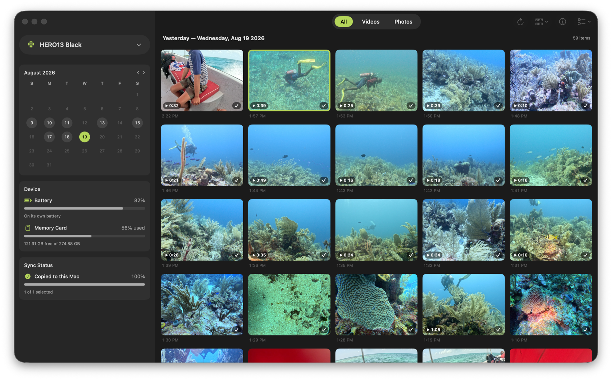
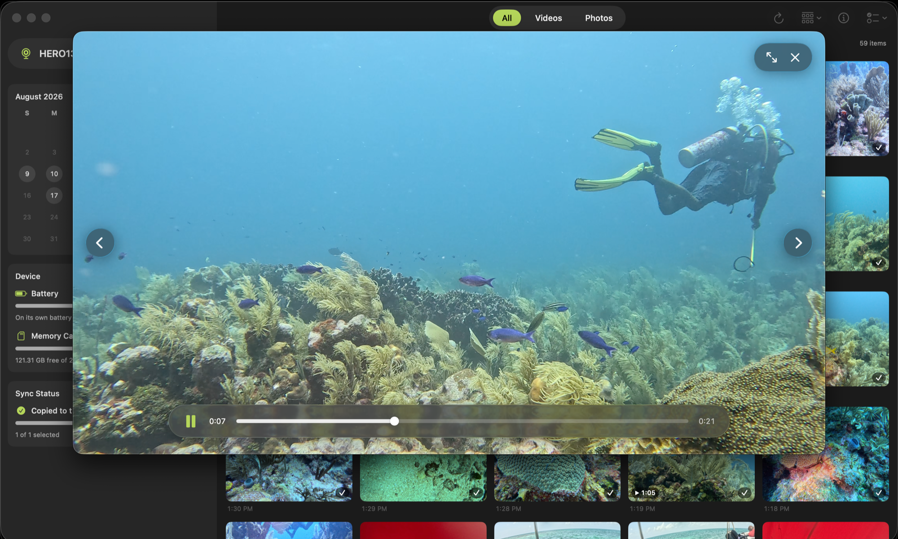

# GoProViewer

Version **1.16.0**

A simple macOS app to browse, preview, and copy files your GoPro to your mac.

Connect your camera to your mac, turn your camera on, enjoy! that's it.






## Supported devices

- **Camera**: built and tested with a HERO13 Black, but nothing in the app is model-specific — any camera that speaks Open GoPro over USB should work: HERO10 Black and everything after (HERO11 Black / Mini, HERO12, HERO13, MAX 2, …). HERO9 Black's USB mode is older RNDIS networking that macOS doesn't support natively; it can still connect over Wi-Fi with a manual IP (see Settings).
- **Mac**: Apple Silicon (M1 or later), macOS 14 Sonoma or newer.

## Features

- **The app never deletes anything from the camera.** There is deliberately no delete code at all — the camera is treated as strictly read-only.
- Thumbnail grid grouped by capture day; filters for videos/photos. Chaptered videos and burst/time-lapse groups appear as single items.
- **View** menu in the toolbar: sort by date ascending or descending, and show either all items or only the ones not copied yet. Both stick across launches.
- Finder-style selection: click selects one item, **⌘-click** toggles, **⇧-click** extends the range, ⌘⇧A selects everything visible. Selected items are marked by the accent border.
- Double-click to preview. Photos load instantly (camera's preview JPEG, with full-res on demand) and **zoom with trackpad pinch** or ⌘+ / ⌘− / ⌘0, panning by scroll. Hover a video in the grid and it plays there, muted and looping, off the camera's small low-quality copy. Open one and it **streams straight off the camera** at full quality without downloading; chaptered videos play through in sequence. Every control floats over the media on a blurred pill: **space** plays/pauses, **←/→** skip 5 seconds, and the camera's HiLight tags sit on the timeline as **gold marks** you can click to jump to. **`<` / `>`** (or `,` / `.`) move between items with a slide animation.
- Select → Download: sequential queue with progress + speed, HTTP-range resume of interrupted files, GoPro *turbo transfer* mode for batches, per-day destination folders, original capture timestamps, already-downloaded detection (green check), and `(2)` suffixing when GoPro's recycled filenames collide. "Select N Missing Items" in the Select menu (⌘⇧M) grabs everything not yet transferred for a one-shot catch-up.
- Optional per Settings: include `.GPR` raws, include `.LRV`/`.THM` proxies, and the day-folder naming pattern (`YYYYMMDD` by default; try `YYYY-MM-DD`, or `YYYY/MM/DD` to nest).
- Metadata inspector beside the grid (**ⓘ** button, **⌘I**, or right-click → Get Info): duration, resolution, frame rate, HyperSmooth, HiLights, and every field the camera reports in plain English — plus the clip's **GPS location and track on a map** (read from the video's GPMF telemetry, when the camera's GPS was on), with one click to open it in Apple Maps.
- Optional **auto-open on connect** (Settings → Connection): a tiny per-user launch agent watches USB and opens the app the moment a GoPro is plugged in.
- Live battery / SD-card status in the sidebar; distinguishes "camera asleep" from "not plugged in".
- Displayed times are the camera's own clock (GoPro timestamps carry no timezone).
- If discovery fails, set a manual IP in Settings — also works over Wi-Fi/COHN if the camera is reachable on your LAN.
- Thumbnails cache in `~/Library/Caches/GoProOffload/`; transfer activity is logged to `~/Library/Logs/GoProOffload.log`.
- Default destination is `~/Movies/GoPro` (changeable in the sidebar or Settings).

## Changelog

### 1.16.0

**New**
- **Send to Google Photos.** When browsing this Mac, the sidebar can upload the selected photos and videos to your Google Photos library — connect your Google account once, from the sidebar or from Settings. Files go up in small pieces, so a flaky connection costs moments, not the file: a dropped or stalled upload retries by itself and resumes from where it actually left off, instead of starting a multi-gigabyte clip over. The app remembers what it has already sent, so uploading a selection twice never creates duplicates. And it is upload-only by construction: Google removed apps' permission to read your library in March 2025, so it can never see — let alone touch — what's already there.
- The tile being copied or uploaded says so in its corner — "Uploading… 43%" — and on completion the badge settles into the familiar tick (or a little cloud, for items in your photo cloud) right where it stood. The sidebar's upload card shows a spinner, moves smoothly through big files, and has a button to stop.
- Already put something in Google Photos yourself, before the app could track it? Right-click it (or a whole selection — a day, say) and *Mark as Already in Google Photos*: it gets its badge, and uploads skip it. The same menu unmarks.
- If connecting to Google — or an upload — doesn't work, the app now says what went wrong right under the button, instead of quietly doing nothing.
- **A sidebar of cards.** Under the source picker the sidebar is now a tidy stack: the calendar (titled by its month), a *Device* card with battery and storage, and a *Sync Status* card showing how much of the library is copied or uploaded — joined by the live progress while a copy or upload runs. The Copy and Upload buttons keep their place at the bottom, and step aside while their transfer is running.
- **Photos tell their story.** The ⓘ inspector has a Photo section: resolution, aperture, shutter, ISO, focal length, exposure bias, white balance, metering and color profile — read from the picture itself, whether it's still on the camera or already copied here.
- Browsing this Mac, right-click any item to reveal it in Finder — or just click the folder path in the inspector.

**Fixed**
- The GoPro / This Mac dropdown at the top of the sidebar could stop responding to clicks (it would still light up under the mouse, but the menu never opened). It has been rebuilt so that can't happen.
- A hover preview no longer keeps playing after its tile scrolls out from under the pointer — and when the scroll sets the pointer down on a different video, that one starts playing instead.
- The copied and uploaded gauges round down now, so they only say 100% when every item is truly there.

### 1.15.0

**New**
- **Where it was shot.** Select a clip or a photo, open the ⓘ inspector, and the Location panel shows it on a map with its coordinates, its altitude and a button to open the spot in Maps. A video takes its position from the camera's own telemetry, a photo from what the camera wrote into the picture.
- Items already copied to this Mac show their location too: pick this Mac as the source and the panel fills in the same way.

**Fixed**
- The Location panel used to be empty for everything, whatever it was shot with. The app was asking the camera for a clip's telemetry, and the camera answers that particular request with a short summary that carries no position at all — so there was never anything to draw.
- Finding a location is quick even on an hour-long recording: only the small parts of the file that hold position data are read, several at a time, sampled evenly across the clip rather than second by second.

### 1.14.0

**New**
- **Browse what's already on this Mac.** The sidebar starts with a source picker — your camera, or this Mac. Pick this Mac and the same grid shows everything you've copied, grouped by day, with the same previews and full-screen viewer. No camera needed, and the picker is there whether or not one is plugged in.
- Hovering a video plays it here too, straight from the file — no proxy needed, since nothing has to cross the USB link.
- The sidebar gauges follow the source: battery, memory card and copy progress for the camera; this Mac's own battery, disk space and library size when you're browsing what's already here.

### 1.13.1

**New**
- The sidebar reads as a column of gauges: **battery, card and copy progress** all share one shape — icon, name, percentage, bar, and a line of detail underneath.
- The battery gauge knows the camera is charging on the USB link, and works out **how long until it's full** from how fast the charge is climbing.
- Day headings say **"Today —"** and **"Yesterday —"** when they apply.
- Grid tiles sharpen up a moment after they appear: the small thumbnail lands first, then the camera's larger preview replaces it, so tiles no longer look soft on a Retina display.

**Changed**
- One word for the operation everywhere: things are **copied**, not "transferred".
- The Destination section left the sidebar — it's all in Settings (⌘,).
- The **Copy** button only appears when the selection contains something that isn't already on this Mac.
- Camera name only in the sidebar header; the firmware version is gone.

**Fixed**
- The card gauge can't read past full any more. Free space and capacity come from two separate camera fields that don't have to agree, which could show "103% used" and negative free space.
- Long values in the info panel (media IDs especially) ellipsise on one line instead of wrapping under their label.

### 1.12.2

**Fixed**
- **Hover previews are no longer pixelated.** The video was being decoded at half resolution on Retina displays and stretched to fit; it now renders at the display's own resolution and scales smoothly.
- Photo previews stay smooth as you zoom, and thumbnails are resampled properly when a cell is larger than the image the camera sends.

### 1.12.1

**New**
- The preview opens in its own window, with the picture filling it edge to edge and nothing else on top of it: transfer / full screen / close sit in a frosted pill at the top right, and big round arrows on the left and right move through your media.
- **Full screen**, for photos as well as videos. In full screen the controls fade away while you watch and come back the moment you move the mouse.
- The window takes the shape of whatever you're looking at, so a clip or a photo never sits inside black bars — and it keeps that shape as you resize it.
- **Hover a video in the grid and it plays right there**, silently and on a loop. That preview uses the camera's small low-quality copy so it starts almost instantly; opening the item plays it at full quality.
- Videos always play at full quality in the preview now. Space plays and pauses, ←/→ skip 5 seconds, and `,` / `.` move to the previous or next item.
- **The info panel moved next to the grid**, where you're browsing: click the ⓘ button (or ⌘I, or right-click a thumbnail → Get Info) and it shows the date, size, resolution, frame rate, HiLights and GPS map of whichever item you last clicked. The preview window stays clean.
- The metadata list reads in plain English now instead of the camera's short codes: "Captured as: Chaptered video", "Lens: Front", "Audio: Stereo", "Proxy (.LRV) size: 13.3 MB", "Transcoded by the camera: No". Anything a future firmware sends that isn't recognised still appears, exactly as sent, under "Unrecognised fields".
- Selected items are marked by the accent border alone — the corner checkmark is gone. "Transfer This File" only shows up for files you haven't copied yet.

**Fixed**
- Video thumbnails no longer show black bars in the grid.

### 1.11.0

**New**
- The sidebar can be collapsed with ⌃⌘S (or View → Hide Sidebar), and stays that way next time you open the app.
- **All / Videos / Photos** tabs above the grid, switchable with ⌘1 / ⌘2 / ⌘3.
- A **View** menu to sort by date, oldest or newest first, and to hide everything you've already copied. Your choice is remembered.
- The camera's HiLight tags show up as gold marks on the video timeline — click one to jump straight to that moment.
- Thumbnails show the capture time, and the copied badge tells you which folder the file is already in.

### 1.10.0

**New**
- The sidebar runs the full height of the window, and transfer progress — speed, size, cancel and retry — lives at the bottom of it.
- The Transfer button appears only when you've selected something.

### 1.9.0

**New**
- The Transfer button moved to the bottom of the sidebar and tells you how much you're about to copy.

### 1.8.0

**New**
- The All / Videos / Photos filter moved out of the sidebar to tabs above the grid.

### 1.7.0

**New**
- **Select N Missing Items** (⌘⇧M, also in the Select menu) picks out everything you haven't copied yet, so one Transfer catches you up.
- Cleaner, flatter sidebar.

### 1.5.0

**New**
- A camera emulator for development (`tools/gopro_emulator.py`), so the app can be worked on without a GoPro plugged in.

**Fixed**
- Cameras connected over Wi-Fi or a manual IP no longer disconnect after a few seconds.
- Grid cells no longer grow and overlap when a photo or video isn't the usual shape.

### 1.3.0

**New**
- The sidebar tells you how many items you haven't transferred yet, with a one-click button to get them.

**Fixed**
- Photos now sit centred in the preview instead of clinging to a corner.
- A video that plays to the end rewinds to its first frame so you can watch it again.

### 1.2.0

**New**
- Info panel in the preview (ⓘ or ⌘I): everything the camera knows about a file, plus where it was shot on a map with an "Open in Maps" shortcut.

### 1.1.0

**New**
- Optional setting to open GoProViewer automatically whenever you plug in a GoPro.

## How to connect your GoPro ?

1. Plug the camera into the Mac with USB-C.
2. On the camera (only once): swipe down → **Preferences → Connections → USB Connection → GoPro Connect** (not MTP).
3. Wake the camera (tap any button). macOS brings up a network interface named after the camera (e.g. "HERO13 Black") and the app finds the camera automatically at `172.2x.x.51`.

## How to install ?

Apple Silicon, macOS 14+. Paste this in Terminal (type "terminal" in the Spotlight search and press Enter, then paste the line below and press Enter) — it downloads the [latest release](https://github.com/ramlongcat/gopro-viewer/releases/latest), installs it to `/Applications`, and launches it:

```
curl -fsSL https://raw.githubusercontent.com/ramlongcat/gopro-viewer/main/install.sh | bash
```

First launch triggers macOS's **Local Network** permission prompt — allow it; that's the USB link to the camera.

## Advanced

### Manual install

Prefer installing it by hand? Grab `GoProViewer.app.zip` from the [latest release](https://github.com/ramlongcat/gopro-viewer/releases/latest), unzip, drop `GoProViewer.app` into `/Applications`, then clear the quarantine flag (the app is ad-hoc signed — macOS would otherwise report it as "damaged"):

```
xattr -dr com.apple.quarantine /Applications/GoProViewer.app
```

### Build & run from source

```
./build.sh --open
```

Builds with the system Swift toolchain and produces `dist/GoProViewer.app` (ad-hoc signed). The same **Local Network** prompt applies on first launch.

The app's version is read from the [`VERSION`](VERSION) file at build time and stamped into the bundle — to cut a release, bump it there, mirror it in this README's header, and add a Changelog entry above.

### Developing without a camera

`tools/gopro_emulator.py` (Python 3, no dependencies, macOS) impersonates a camera on `127.0.0.1:8080`, serving the Open GoPro endpoints the app uses — media list/info, thumbnails (via `sips`/`qlmanage`), HTTP-range downloads/streaming, and synthesized GPMF GPS tracks so the metadata inspector's map has data:

```
tools/gopro_emulator.py --library ~/Movies/GoPro
```

Point it at any folder of GoPro media (previously transferred files are ideal; non-GoPro-named `.mp4`/`.jpg` files get synthetic camera names, and an empty library folder is auto-filled with generated photos). The app discovers it automatically within a few seconds of launch, exactly like plugging a camera in — no settings needed. A real camera always takes priority, and localhost is only believed if it answers the version endpoint with proper JSON, so an unrelated local server on port 8080 won't be mistaken for a camera. Flags: `--throttle` (MB/s) and `--latency` (ms) simulate slow USB links, `--battery` sets the reported charge, and `--fake N` (default 1) adds generated photos that are never at the destination so the untransferred-items card stays testable (`--fake 0` to disable; transferring them drops small `GP0199xx.JPG` files into your destination folder).

### How does it work ?

The app talks to the camera's built-in HTTP server via the [Open GoPro](https://gopro.github.io/OpenGoPro/) wired API. In GoPro Connect mode the camera shows up as a USB network interface, and the app finds it there at `172.2x.x.51:8080` — media listing, thumbnails, previews, video streaming, and downloads are all plain HTTP from that point on.

## Feature suggestions?

Missing something, or have an idea that would make the app better? Please [open an issue on GitHub](https://github.com/ramlongcat/gopro-viewer/issues) — thanks!

## Privacy & terms

Everything stays on your Mac; the optional Google Photos feature is upload-only. See the [privacy policy](https://ramlongcat.github.io/gopro-viewer/privacy.html) and [terms of service](https://ramlongcat.github.io/gopro-viewer/terms.html).
